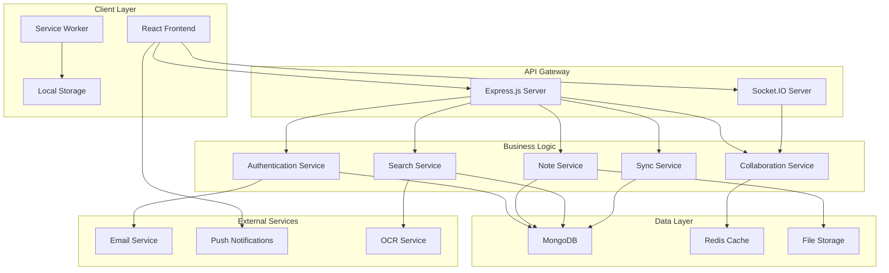

# Design Document

## Overview

The Google Keep Clone is a full-stack web application that replicates Google Keep's functionality using modern web technologies. The system follows a client-server architecture with real-time synchronization, offline capabilities, and collaborative features. The frontend is built with React and provides a responsive, Material Design-inspired interface, while the backend uses Node.js with Express and MongoDB for scalable data management.

## Architecture

### High-Level Architecture



### Technology Stack

**Frontend:**
- React 18 with functional components and hooks
- Material-UI for consistent design system
- React Router for client-side routing
- Axios for HTTP requests
- Socket.IO client for real-time communication
- React Query for server state management
- Workbox for service worker and offline functionality

**Backend:**
- Node.js with Express.js framework
- Socket.IO for WebSocket communication
- JWT for authentication
- Bcrypt for password hashing
- Multer for file uploads
- Node-cron for scheduled tasks

**Database:**
- MongoDB for primary data storage
- Redis for caching and session management
- GridFS for file storage

**Infrastructure:**
- Docker for containerization
- NGINX for reverse proxy and load balancing
- PM2 for process management

## Components and Interfaces

### Frontend Components

#### Core Components

**App Component**
- Root component managing global state and routing
- Handles authentication state and user session
- Provides theme and context providers

**Dashboard Component**
- Main interface displaying notes in grid or list view
- Implements infinite scrolling for performance
- Manages note filtering and search functionality

**NoteEditor Component**
- Rich text editor with formatting options
- Supports different note types (text, list, drawing, audio)
- Real-time auto-save functionality
- Collaborative editing with conflict resolution

**NoteCard Component**
- Individual note display with preview
- Quick actions (archive, delete, share, label)
- Drag and drop support for reordering

#### Specialized Components

**LabelManager Component**
- Create, edit, and delete labels
- Color picker for label customization
- Bulk label operations

**SearchInterface Component**
- Advanced search with filters
- Search suggestions and autocomplete
- Voice search integration

**CollaborationPanel Component**
- Share note functionality
- Manage collaborators and permissions
- Real-time presence indicators

### Backend Services

#### Authentication Service

```javascript
class AuthService {
  async register(userData) {
    // Validate input data
    // Hash password with bcrypt
    // Create user account
    // Generate JWT token
    // Return user profile and token
  }
  
  async login(credentials) {
    // Validate credentials
    // Verify password
    // Generate JWT token
    // Update last login timestamp
    // Return user profile and token
  }
  
  async resetPassword(email) {
    // Generate reset token
    // Send email with reset link
    // Set token expiration
  }
}
```

#### Note Service

```javascript
class NoteService {
  async createNote(noteData, userId) {
    // Validate note data
    // Generate unique note ID
    // Set timestamps and ownership
    // Save to database
    // Trigger sync to collaborators
  }
  
  async updateNote(noteId, updates, userId) {
    // Verify user permissions
    // Apply operational transformation for conflicts
    // Update note in database
    // Broadcast changes to collaborators
    // Update search index
  }
  
  async searchNotes(query, filters, userId) {
    // Parse search query
    // Apply filters (labels, colors, dates)
    // Perform full-text search
    // Include OCR text from images
    // Return ranked results
  }
}
```

#### Collaboration Service

```javascript
class CollaborationService {
  async shareNote(noteId, permissions, collaborators) {
    // Validate sharing permissions
    // Create collaboration records
    // Send invitation notifications
    // Set up real-time sync channels
  }
  
  async handleRealtimeEdit(noteId, operation, userId) {
    // Apply operational transformation
    // Broadcast to all collaborators
    // Resolve conflicts using CRDT principles
    // Update note state
  }
}
```

## Data Models

### User Model

```javascript
const userSchema = {
  _id: ObjectId,
  email: String, // unique, required
  password: String, // hashed with bcrypt
  name: String,
  avatar: String, // URL to profile image
  preferences: {
    theme: String, // 'light' | 'dark' | 'auto'
    defaultView: String, // 'grid' | 'list'
    language: String
  },
  createdAt: Date,
  updatedAt: Date,
  lastLoginAt: Date,
  isEmailVerified: Boolean,
  resetToken: String,
  resetTokenExpiry: Date
}
```

### Note Model

```javascript
const noteSchema = {
  _id: ObjectId,
  title: String,
  content: {
    type: String, // 'text' | 'list' | 'drawing' | 'audio'
    data: Mixed, // Content varies by type
    formatting: Object // Rich text formatting
  },
  owner: ObjectId, // Reference to User
  collaborators: [{
    user: ObjectId,
    permission: String, // 'view' | 'edit'
    addedAt: Date
  }],
  labels: [ObjectId], // References to Label
  color: String,
  isPinned: Boolean,
  isArchived: Boolean,
  isDeleted: Boolean,
  deletedAt: Date,
  reminders: [{
    type: String, // 'time' | 'location'
    datetime: Date,
    location: {
      latitude: Number,
      longitude: Number,
      address: String
    },
    isCompleted: Boolean
  }],
  attachments: [{
    type: String, // 'image' | 'audio' | 'drawing'
    url: String,
    filename: String,
    size: Number,
    ocrText: String // For images
  }],
  version: Number, // For conflict resolution
  createdAt: Date,
  updatedAt: Date
}
```

### Label Model

```javascript
const labelSchema = {
  _id: ObjectId,
  name: String,
  color: String,
  owner: ObjectId, // Reference to User
  createdAt: Date,
  updatedAt: Date
}
```

### Collaboration Session Model

```javascript
const collaborationSessionSchema = {
  _id: ObjectId,
  noteId: ObjectId,
  participants: [{
    userId: ObjectId,
    socketId: String,
    cursor: {
      position: Number,
      selection: {
        start: Number,
        end: Number
      }
    },
    lastSeen: Date
  }],
  operations: [{
    type: String, // 'insert' | 'delete' | 'format'
    position: Number,
    content: String,
    userId: ObjectId,
    timestamp: Date,
    version: Number
  }],
  createdAt: Date,
  updatedAt: Date
}
```